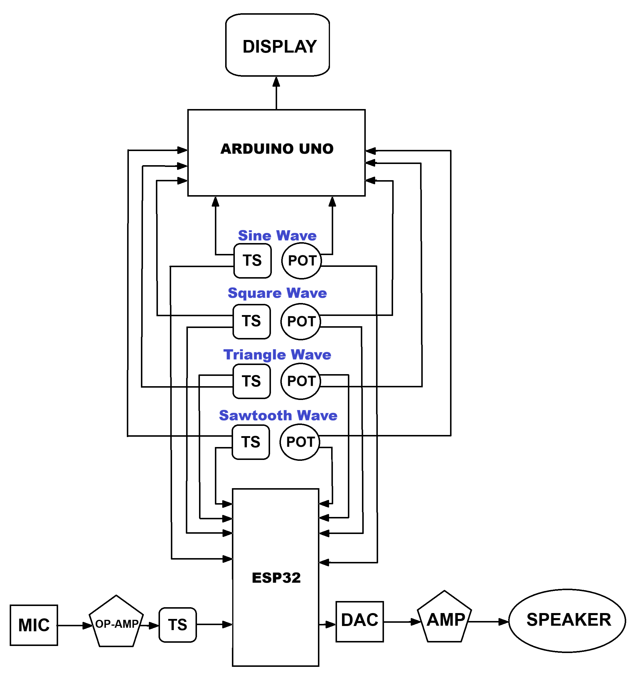
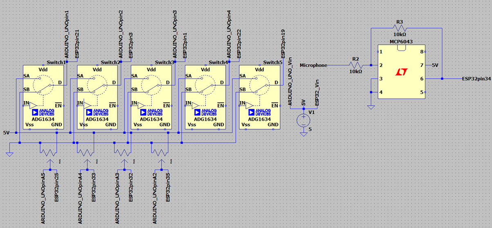
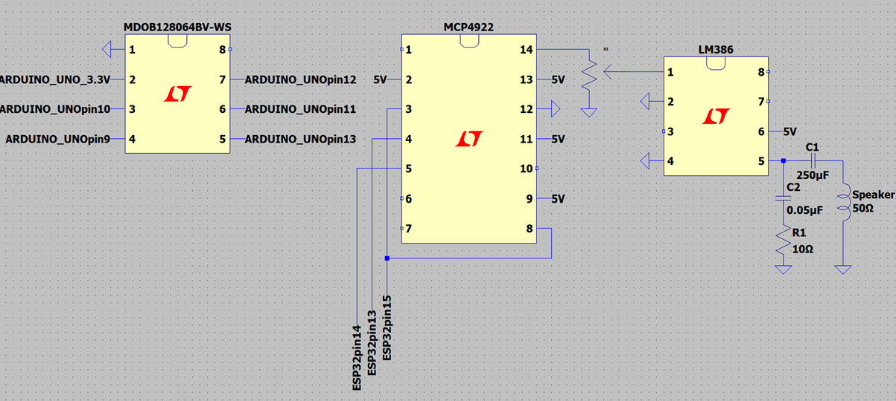
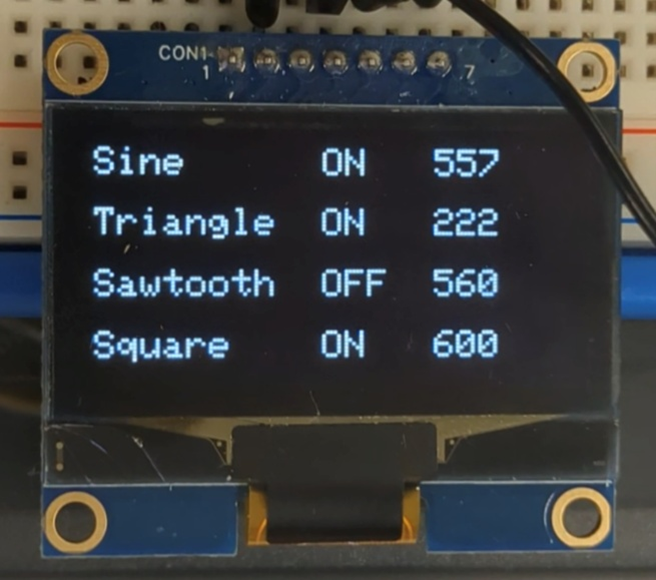
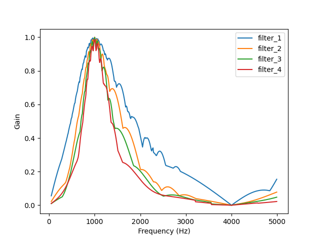
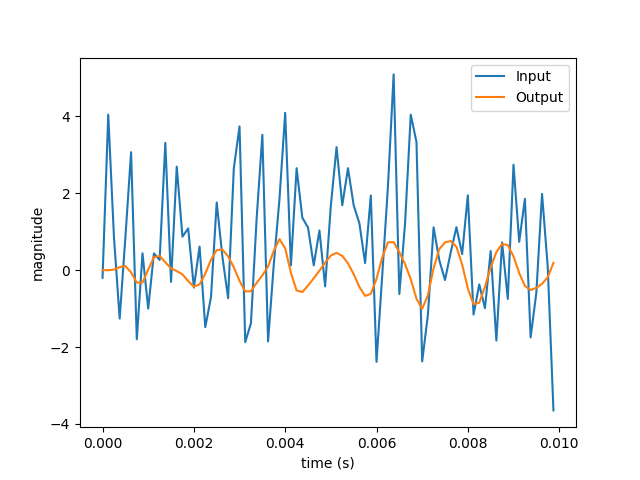
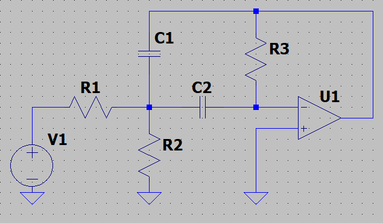
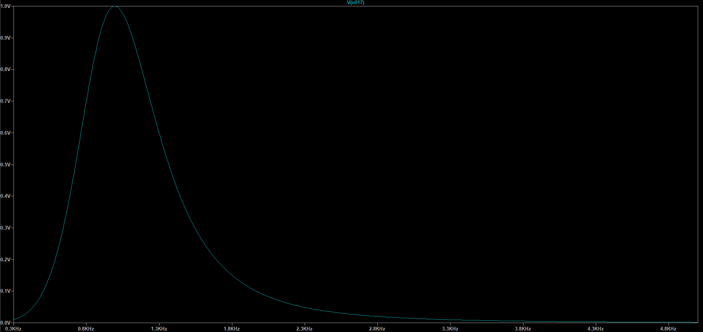
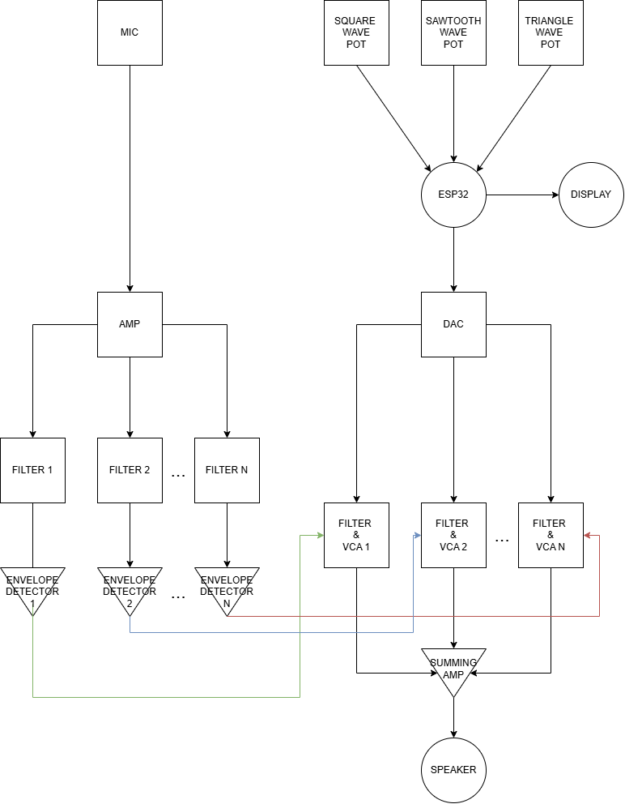

<center>
	<video src="Demonstration.mp4" width="450" height="250" controls></video>
</center>

## Description
A Voice-encoder (Vocoder) is a signal processing device that can alter the sound of a human voice by making it sound robotic or harmonized.
It performs this by taking a modulating signal (human voice) and modulating a carrier signal (a synthesiser).

There are three main stages in a Vocoder:

1. Input Signal Conditioning:

	-	Suitably amplify and condition speech input signal  

2. Analysis (Modulation):

	- The input speech is passed through a bank of band-pass filters, dividing it into multiple frequency bands.

	- The amplitude envelope of each band is extracted (typically using rectification and low-pass filtering).

	- This creates a set of control signals representing the dynamic spectral profile of the voice.

3. Synthesis (Modulation of Carrier):

	- A carrier signal (e.g. a sawtooth wave, white noise, or another voice) is passed through the same filter bank.

	- The previously extracted envelopes modulate the amplitude of the carrier signal in each band.

	- The outputs of all bands are summed, recreating speech-like audio with the timbre of the modulator but the dynamics of the original voice.

# Components
| Component                              | Quantity | Notes |
|---------------|----------|-----------------------------------|
|[ESP-WROOM-32](https://www.espressif.com/sites/default/files/documentation/esp32-wroom-32_datasheet_en.pdf) Microcontroller | 1 | Performs digital signal processing tasks such as envelope detection, FFT, and audio synthesis |
| [MCP4922](https://ww1.microchip.com/downloads/en/devicedoc/22250a.pdf) 12-bit DAC| 1       | Converts digitally processed audio/control signals back to analog for amplification |
| [MCP6043](https://ww1.microchip.com/downloads/en/DeviceDoc/20001669e.pdf) Op-Amp| 1        | Preamplifies microphone  before being sampled by ESP |
| [LM386](https://www.ti.com/lit/ds/symlink/lm386.pdf) Audio Power Amp                  | 1        | Amplifies the modulated signal to speaker-driving levels|
| [K 50 WP 8Ω](https://www.visaton.de/sites/default/files/dd_product/K%2050%20WP_2915-17_1.pdf) Speaker                     | 1        | Required for audio output |
| 10Ω Resistor (5%)                      | 1        | Required for Audio Amp |
| 10kΩ Resistor (5%)                         | 2        | Required for Op-Amp feedback and Audio Amp input |
| 250μF Electrolytic Capacitor           | 1        | AC-couples the amplified audio output to the speaker, blocking DC offset |
| Toggle Switch                          | 4        | Required to control carrier signal shape |
| 10kΩ Linear Potentiometer                     | 5        | Required to set carrier signal frequency & Audio Amp level |
| Oscilloscope (Generic)                 | 1        | Used to visualize signal behavior at different stages (e.g., preamp output, DAC output, LM386 output) |
| [DFR0034 Sound sensor](https://wiki.dfrobot.com/Analog_Sound_Sensor_SKU__DFR0034)                 | 1        | Used to extractive signal from speech |

## Block Diagram


## Wiring Diagram

<br>


# Build and Test

## Microphone Input
Initially to verify the functionality of the microphone’s functionality, its output signal underwent the necessary conditioning (i.e., amplification via MCP6043) and was fed directly into an oscilloscope’s input, from this it was observed that the microphone adequately and promptly responded to changes at its input with all variations centred at a DC value of 0. As an extension, a monotone waveform (i.e., sine wave) was taken as input to the speaker and the resultant waveform appeared to match this. Therefore, verifying required functionality of the microphone’s input/output.

## DAC
The DAC is tested using a code that generates a digital sine wave. The SPI pins on the ESP32 are used due to their high speed. The code outputs a 16-bit integer; 4-bits to configure the DAC and a 12-bit integer value that will be converted from digital to analogue. The input pin of the DAC is connected to the ESP32. The DAC output is connected to an oscilloscope. The oscilloscope displays a sine wave if the DAC is operating correctly.
The DAC and microphone are tested in conjunction. The microphone input is read by the ESP32. The analogue input is a value between 0 and 4096; this is because the ESP32 has a 12-bit ADC. The code divides the microphone input by 4095 (float) which converts the microphone input to a number between 0.0 and 1.0. The number is mapped onto a 12-bit integer value that is sent to the DAC. The oscilloscope is connected to the DAC output as before. It will show the sound waves that the microphone is picking up. The DAC and microphone functionality has now been verified, and both components are now ready to be incorporated into the final design. 

## Speaker
The speaker is wired directly to the oscilloscope. The oscilloscope functions as a wave generator to send a sine wave into the speaker. Ensure the frequency is within the audible range for humans (around 20 Hz to 20 kHz). The sound emitted from the speaker clear and smooth, like a flute.

## Display 
The OLED display shows all the carrier waves; if they are on or off and their frequency. The display is wired to the Arduino Uno SPI pins. The four buttons which turn each wave on and off are wired to digital pins on the Arduino. The four potentiometers that control the frequency of each wave are wired to analogue pins. The output of the potentiometer is the nmapped onto a frequency.
```cpp
float freq = 200.0f + 400.0f * (analogRead(FREQ) / 1023.0f);
``` 
The value is divided by 1023 because the Arduino has a 10-bit ADC producing a number between 0.0 and 1.0. This number is multiplied by 400 and added to 200. The frequency range is from 200Hz to 600Hz. The Arduino code for the display utilises the [Adafruit_SSD1306 library](https://github.com/adafruit/Adafruit_SSD1306). 


# Digital Signal Processing

## Synthesiser

### Implementation
The carrier wave in the Vocoder is generated by a simple synthesiser module on the microcontroller.
This module is capable of generating sine, sawtooth, triangle, and square waves.
These waves are summed together to create a more complex signal.
The frequency of each of these component waves can be controlled independently by using four potentiometers,
from 200 to 600 hz.
Each component signal can also be enabled or disabled by using a switch.

First, a struct to hold the synthesiser data is defined.
```cpp
struct Synth {
	SynthType type; // Types of waves to generate.
	float f[4];     // Frequency of waves.
	float t[4];     // Parameter of each wave.
};
```
Here, `SynthType` represents the types of waves to generate.
This is implemented as an enum class.
```cpp
enum class SynthType {
	Square   = 1<<0,
	Sawtooth = 1<<1,
	Triangle = 1<<2,
	Sine     = 1<<3
};
```
We define each type as a power of 2 so that the wave type can be stored as a bitmask.
This allows enabling the generation of multiple wave types at the same time.
The `f` and `t` members of `Synth` are four component arrays to allow this as well.

Instead of writing functions that repeat every $\textrm{t}=\frac{1}{\textrm{f}}$ seconds,
we wrote functions that repeat every $\textrm{t}=1$.
This simplifies the code to generate the waves.
In order to add frequency control,
we don't define `t` as $\textrm{t}=\int_{0}^{\tau}d\tau=\tau$, where $\tau$ is the current time.
We instead define the `t` parameter as $\textrm{t}=\int_{0}^{\tau}\textrm{f}\,d\tau$.
This also has two added benefits:
- The waves remain continuous when `f` changes without having to calculate a phase offset to apply.
- The wave functions will not depend on an expensive $\frac{1}{\textrm{f}}$ calculation.

The function to generate the synthesised wave is defined as
```cpp
float synth_run(Synth *synth, float dt)
```
The new `t` values for each wave is calculated with the following loop
```cpp
for (int i = 0; i < 4; ++i) {
	synth->t[i] = fmodf(synth->t[i] + dt * synth->f[i], 1.0f);
}
```
The `fmodf` function is used to keep the parameters between 0 and 1.
The code used to generate the final wave from this is as follows:
```cpp
if ((uint32_t)synth->type & (uint32_t)SynthType::Square) {
	out += (synth->t[0] < 0.5f) * 2.0f - 1.0f;
	++scale;
}
if ((uint32_t)synth->type & (uint32_t)SynthType::Sawtooth) {
	out += synth->t[1] * 2.0f - 1.0f;
	++scale;
}
if ((uint32_t)synth->type & (uint32_t)SynthType::Triangle) {
	out += (synth->t[2] + 2.0f * (0.5f - synth->t[2])
	     * (synth->t[2] > 0.5f)) * 4.0f - 1.0f;
	++scale;
}
if ((uint32_t)synth->type & (uint32_t)SynthType::Sine) {
	out += sinf(synth->t[3] * 2 * (float)M_PI);
	++scale;
}
```
To detect if a certain type of wave is enabled,
the `&` operator is used to extract the corresponding bit.
If the result is non-zero, the wave type is enabled.
The `scale` parameter is incremented for every wave added to the final signal.
This is then used to scale the final wave to prevent it from exceeding a magnitude of 1 at any point.
```cpp
if (scale != 0)
	out /= scale;
```
Finally, the wave is returned from the function for use elsewhere in the program.
```cpp
return out;
```

### Testing
The synthesiser was tested by outputting the generated wave to an oscilloscope.
With this, we could test that the synthesiser generated waves of the correct frequency and shape.

## Band Pass Filters

### Designing
In order to test our digital band pass filters,
we first implemented it in python.
This allowed us to test the frequency response and ensure it's working correctly,
as well as test different parameters easily.
The filter design we implemented was a digital biquad filter.
The code to implement this is as follows
```py
class BiquadFilter:
	def __init__(self, F_0, Q, gain, sample_rate):
		self.F_0 = F_0
		self.Q = Q
		self.gain = gain
		self.sample_rate = sample_rate

		self.x1 = 0
		self.x2 = 0
		self.y1 = 0
		self.y2 = 0

		self._compute_coefficients()

	def _compute_coefficients(self):
		omega = 2 * math.pi * self.F_0 / self.sample_rate
		alpha = math.sin(omega) / (2 * self.Q)
		a0 = 1 + alpha

		self.a1 = (-2 * math.cos(omega)) / a0
		self.a2 = (1 - alpha           ) / a0
		self.b0 = (alpha * self.gain   ) / a0
		self.b2 = (-alpha * self.gain  ) / a0

	def step(self, x):
		y = self.b0 * x + self.b2 * self.x2 \
		  - self.a1 * self.y1 - self.a2 * self.y2
		
		self.x2 = self.x1
		self.x1 = x
		self.y2 = self.y1
		self.y1 = y

	def reset(self):
		self.x1 = self.x2 = self.y1 = self.y2 = 0
	
	def get_output(self):
		return self.y1
```
We also tested cascading filters to improve results.
This is the code we used to implement this.
```py
import copy

class HighOrderFilter:
	def __init__(self, filter, order):
		self.filters = [copy.deepcopy(filter) for i in range(order)]
	
	def step(self, x):
		self.filters[0].step(x)
		for i in range(len(self.filters) - 1):
			self.filters[i + 1].step(self.filters[i].get_output())
	
	def reset(self):
		for filter in self.filters:
			filter.reset()

	def get_output(self):
		return self.filters[-1].get_output()
```
It just copies the filter `order` times and takes the input from one filter and passes it to the next filter.
To test the frequency response of the filters,
we wrote a class to generate a sine wave.
```py
import math

class SineSignal:
	def __init__(self, freq):
		self.freq = freq
	
	def __call__(self, t):
		return math.sin(2*math.pi*self.freq*t)
```
To simulate the frequency response of a filter,
we run the filter for 4 periods of a sine wave.
The gain of the filter for this frequency is calculated as the maximum output value.
We repeat this for a range of frequencies and graph the result so that we can evaluate the effectiveness of the filter.
```py
import matplotlib.pyplot as plt

def eval_signal(filter, signal, dt, step_count):
	filter.reset()

	v_i = [signal(dt*i) for i in range(step_count)]
	v_o = [0] * step_count
	for i in range(step_count):
		v_o[i] = filter.get_output()
		filter.step(v_i[i], dt)
	
	return (v_i, v_o)

def eval_sine_period(filter, freq, periods, dt):
	return eval_signal(filter, SineSignal(freq), dt, int(periods/dt/freq))

def plot_freq_response(filter, freq_begin, freq_end, freq_step, dt):
	step_count = int((freq_end - freq_begin) / freq_step)
	freq = [freq_begin + i*freq_step for i in range(step_count)]
	out = [0] * step_count

	for i in range(step_count):
		out[i] = max(eval_sine_period(filter, freq[i], 4, dt)[1])
	
	plt.plot(freq, out)
```
Finally, we test the frequency response of a biquad filter and several high order filters contructed from it.
Here is an example of a test that we ran.
```py
dt  = 1/(8e3) # 8 kHz sample rate.
f_l = 500
f_u = 1500
f_0 = (f_l+f_u)/2
#                       F_0,      Q       , gain, sample_rate
filter_1 = BiquadFilter(f_0, f_0/(f_u-f_l),  1  ,   1/dt)
filter_2 = HighOrderFilter(filter_1, 2)
filter_3 = HighOrderFilter(filter_1, 3)
filter_4 = HighOrderFilter(filter_1, 4)

#                   filter , freq_begin, freq_end, freq_step, dt
plot_freq_response(filter_1,    50     ,   5000  ,    10    , dt)
plot_freq_response(filter_2,    50     ,   5000  ,    10    , dt)
plot_freq_response(filter_3,    50     ,   5000  ,    10    , dt)
plot_freq_response(filter_4,    50     ,   5000  ,    10    , dt)

plt.legend(["filter_1", "filter_2", "filter_3", "filter_4"])
plt.xlabel("Frequency (Hz)")
plt.ylabel("Gain")
plt.show()
```
This produces the following graph.



Due to the much better performance of the higher order filters,
we decided to go with a cascaded filter design.
Because we had the computational headroom with the esp32,
we choose to have four cascaded filters to improve the quality further.

Next, we tested the chosen filter design on signals composed of multiple frequency components.
To visualise the result, we plot the transient response of the filter.
```py
def plot_signal(filter, signal, dt, step_count):
	t = [i*dt for i in range(step_count)]
	v_i, v_o = eval_signal(filter, signal, dt, step_count)

	plt.plot(t, v_i)
	plt.plot(t, v_o)
	plt.legend(["Input", "Output"])
	plt.xlabel("time (s)")
	plt.ylabel("magnitude")
	plt.show()
```
To allow creating signals with multiple components and generating noisy signals,
we define the following to classes:
```py
class SumSignal:
	def __init__(self, signals):
		self.signals = signals

	def __call__(self, t):
		out = 0
		for signal in self.signals:
			out += signal(t)
		return out

class NoiseSignal:
	def __init__(self):
		pass
	
	def __call__(self, t):
		return random() * 2 - 1
```
For this test, we define a signal made up of a sum of sine signals and a noise signal.
The band pass filter is configured to allow 500-1500 Hz through,
so the output should ideally be an 800 Hz sine wave.
```py
dt  = 1/(8e3) # 8 kHz sample rate.
duration = 0.01
f_l = 500
f_u = 1500
f_0 = (f_l+f_u)/2

filter = HighOrderFilter(BiquadFilter(f_0, f_0/(f_u-f_l), 1, 1/dt), 4)

signal = SumSignal([
	SineSignal(800), SineSignal(2400), SineSignal(3800),
	SineSignal( 50), SineSignal(1800), SineSignal(2100),
	NoiseSignal()
])

plot_signal(filter, signal, dt, int(duration/dt))
```
This outputs the following graph:



This filter produced the expected 800 Hz sine wave with only minimal distortion.

### Implementation
Once the filter was designed, implementing it on the microcontroller was simple.
First, we defined two structs to hold the filter configuration and the filter state.
```cpp
struct Filter {
	float a1, a2, b0, b2;
};

struct FilterState {
	float x1, x2, y1, y2;
};
```
We split the filter into two parts as several filters in the Vocoder will use the same configuration.
This way, we don't have to store multiple copies.
The configuration and step functions are pretty much copied over from the python design.
```cpp
void configure_filter(Filter *filter, float f_l, float f_u,
                      float gain, float sample_rate
) {
	float f_0 = 0.5f * (f_u + f_l);
	float Q = f_0 / (f_u - f_l);

	float omega = 2.0f * (float)M_PI * f_0 / sample_rate;
	float alpha = sinf(omega) / (2.0f * Q);

	float a0 = 1.0f + alpha;
	filter->b0 = (alpha * gain) / a0;
	filter->b2 = (-filter->b0) / a0;
	filter->a1 = -2.0f * cosf(omega) / a0;
	filter->a2 = (1.0f - alpha) / a0;
}

float filter_step(Filter *filter, FilterState *state, float x) {
	float y =
		filter->b0 *        x  +
		filter->b2 * state->x2 -
		filter->a1 * state->y1 -
		filter->a2 * state->y2;

	state->x2 = state->x1;
	state->x1 = x;
	state->y2 = state->y1;
	state->y1 = y;

	return y;
}
```
To cascade the filters, we take in one filter configuration and an array of filter states.
The output of one filter is then fed into the input of the next.
The final filter's output is then returned.
```cpp
float cascade_step(Filter *filter, FilterState *states, int state_count, float x) {
	float out = filter_step(filter, states, x);
	for (int i = 1; i < state_count; ++i)
		out = filter_step(filter, states + i, out);
	return out;
}
```

## Envelope Detectors
We use a simple, first order low pass filter on a full wave rectified input to capture the envelope of the input signal.
```cpp
void envelope_step(float *state, float a, float x) {
	*state = (1 - a) * *state + a * std::abs(x);
}
```

## Vocoder

### Implementation
The Vocoder consists of 4 filters for the input signal and 4 filters for the carrier signal.
Each filter is constructed as a cascade of four second order biquad filters.
This gives a total of 4 different filter configurations and $4\times8=32$ filter states.
It also requires four envelope detectors for each of the four filtered bands.
```cpp
struct Vocoder {
	static constexpr int   filter_count      = 4;
	static constexpr int   cascade_count     = 4;
	static constexpr float sample_rate       = 8000.0f;
	static constexpr float dt                = 1.0f/sample_rate;
	static constexpr float f_l = 500.0f, f_u = 2000.0f;
	static constexpr float env_a             = 0.1f;

	Filter filters[filter_count];
	FilterState input_state[filter_count * cascade_count];
	FilterState carrier_state[filter_count * cascade_count];

	float envelope_state[filter_count];
};
```
The filter bands are set up so that they evenly take up a portion of the specified frequency band (500 - 2000 Hz).
The filter and envelope detector states are initialised to 0.
```cpp
void vocoder_init(Vocoder *Vocoder) {
	float step = (Vocoder->f_u - Vocoder->f_l) / Vocoder->filter_count;
	for (int i = 0; i < Vocoder->filter_count; ++i)
		configure_filter(
			Vocoder->filters + i,
			Vocoder->f_l + step * i,
			Vocoder->f_l + step * (i + 1),
			1.0f, Vocoder->sample_rate
		);
	
	memset(Vocoder->input_state   , 0, sizeof(Vocoder->   input_state));
	memset(Vocoder->carrier_state , 0, sizeof(Vocoder-> carrier_state));
	memset(Vocoder->envelope_state, 0, sizeof(Vocoder->envelope_state));
}
```
The first thing that the Vocoder does each step is run the voice input and the synthesiser input through each of the filters.
```cpp
float vocoder_update(Vocoder *Vocoder, float input, float synth_input) {
	float out[Vocoder->filter_count];
	float synth_out[Vocoder->filter_count];

	for (int i = 0; i < Vocoder->filter_count; ++i) {
		out[i] = cascade_step(
			Vocoder->filters + i,
			Vocoder->input_state + i * Vocoder->cascade_count,
			Vocoder->cascade_count,
			input
		);

		synth_out[i] = cascade_step(
			Vocoder->filters + i,
			Vocoder->carrier_state + i * Vocoder->cascade_count,
			Vocoder->cascade_count,
			synth_input
		);
	}
	...
```
Next, it runs the filtered voice input through the envelope detectors in order to extract the magnitude of each band.
```cpp
	...
	for (int i = 0; i < Vocoder->filter_count; ++i)
		envelope_step(
			Vocoder->envelope_state + i,
			Vocoder->env_a,
			out[i]
		);
	...
```
The final step is to multiply each band of the synthesised signal by the amplitude of the corresponding band of the voice signal.
The bands are then summed together to form the final output signal.
```cpp
	...
	float signal = 0.0f;
	for (int i = 0; i < Vocoder->filter_count; ++i) {
		signal += synth_out[i] * Vocoder->envelope_state[i];
	}
	
	return signal;
}
```

### Testing
The Vocoder was tested by running it on a computer, using an audio file as input and using the speakers as output.
This way, the output of the Vocoder could be tested under ideal conditions.
Here is an example run with a 400 Hz square wave tested with the google speech for the word "Vocoder".

<audio controls src="Vocoder.mp3"></audio>

## Putting It Together
The three main DSP components we built are:
- Synthesiser
- Band pass filters
- Envelope detectors
- Vocoder

We have already shown how the band pass filters and envelope detectors are used to form the Vocoder.
The only thing left is to incorporate the synthesiser and the Vocoder into the final program on the microcontroller.
The setup method for the program initialises all of the input pins and initialises the states of the synthesiser and Vocoder.
```cpp
static Vocoder Vocoder;
static Synth synth;

void setup() {
	Serial.begin(9600);
	
	// Initialise pins.
	...
	
	dac_init();
	synth_init(&synth);
	vocoder_init(&Vocoder);
}
```
The loop method starts by reading in the use configuration from several pins.
```cpp
void loop() {
	unsigned long start_time = micros();

	int run_vocoder = digitalRead(19);

	synth.type = (SynthType)(
		  (digitalRead(21) << 0)
		| (digitalRead( 3) << 1)
		| (digitalRead( 1) << 2)
		| (digitalRead(22) << 3)
	);

	synth.f[0] = 200.0f + 400.0f * (analogRead(25) / 4095.0f);
	synth.f[1] = 200.0f + 400.0f * (analogRead(33) / 4095.0f);
	synth.f[2] = 200.0f + 400.0f * (analogRead(32) / 4095.0f);
	synth.f[3] = 200.0f + 400.0f * (analogRead(35) / 4095.0f);
	...
```
It then reads in the microphone input and runs the synthesiser with the read in options.
```cpp
	...
	float input = analogRead(mic_pin) / 4095.0f;
	float synth_input = synth_run(&synth, 1.0f/8000.0f);
	...
```
If the Vocoder is enabled, it runs it and uses its output for the speaker.
If the Vocoder is disabled, then it just passes the synthesiser's output to the speaker.
```cpp
	...
	float output = 0.0f;
	if (run_vocoder) {
		static constexpr float gain = 100.0f;
		output = vocoder_update(&Vocoder, input, synth_input) * gain;
		output = max(-1.0f, min(1.0f, output));
	}
	else {
		output = synth_input;
	}
	...
```
We apply a gain to the output of the Vocoder to make it more audable and to use more bits of the DAC.
The output value is then written to the DAC attached to the speaker.
```cpp
	...
	output = (output + 1.0f) * 0.5f;
	dac_write_float(output);
	...
```
We convert the output to a range of [0, 1] instead of [-1, 1], as the DAC can't output negative values.

The DSP system is designed to run at 8 kHz.
To ensure that we don't run faster than this,
we limit the speed of the loop.
To do this, we first measure how long the current loop iteration took.
At the start of the loop function we record the current time.
```cpp
void loop() {
	unsigned long start_time = micros();
	...
```
Then, at the end of the function, we test if it took more than 125 microseconds.
If it did, then we wait for the remainder of the 125 microsecond target.
```cpp
	...
	unsigned long end_time = start_time + int(125);
	unsigned long time = micros();
	if (time > end_time)
		Serial.println("Running behind\n");
	else
		delayMicroseconds(end_time - time);
}
```

## Alternate Approach
### Using one microcontroller
It is possible to create this Vocoder using only one microcontroller. The ESP32 should be used because it has a higher sampling rate compared to the Arduino Uno. As the ESP32 has two cores, the VSPI and HSPI SPI buses on the ESP32 can be used simultaneously; one can be used for the 12-bit DAC and the other for the OLED display. One ESP32 core is used for the Vocoder. The second ESP32 core could be used to run the display code. 

## Analogue Signal Processing
For this project, we decided to go with digital signal processing.
We did, however, test analogue signal processing as well.
We found analogue signal processing to be less reliable and harder to tune.
Although, a plausible extension to this Vocoder would be to utilise more analogue components in the filtering and modulation stages, to provide the potential to scale the Vocoder from 4 channels to 16 channels as the signal processing capability would no longer be limited by the clock speed of the ESP32. Detailed below are the simulation performed in order to verify a potential analogue design.

### Band Pass Filters
The type of band pass filter we tested was a Bessel-Thompson filter.



#### Component Values
Bessel-Thompson filters have five component values that we can choose.
These values can be related with the following three equations:
$$f_0=\frac{1}{2\pi}\sqrt{\frac{R_1+R_2}{R_1R_2R_3C_1C_2}}$$
$$Q=\frac{f_0}{f_u-f_l}=\sqrt{\frac{\left(R_1+R_2\right)R_3C_1C_2}{R_1R_2\left(C_1+C_2\right)^2}}$$
$$\textrm{Gain}=\frac{2\pi f_0 R_2R_3C_2}{\sqrt{\left(4\pi^2f_0^2R_1R_2R_3C_1C_2-R_1-R_2\right)^2+\left(2\pi f_0\left(C_1+C_2\right)R_1R_2\right)^2}}$$

where $f_0$ is the centre frequency in the pass band, $f_u$ is the upper pass frequency, and $f_l$ is the lower pass frequency.

The first two equations were provided in the notes for this course.
The third equation is obtained by substituting $f_0$ into the filter's frequency response.

Since we have five variables and only three contraints, we just choose $R_1=1,000\,\Omega$ and $R_2=10,000\,\Omega$.
To solve for the other three component values,
we used python and scipy to numerically solve the system of equations.
First, we define the contraints.
```py
def f0_constraint(r1, r2, r3, c1, c2):
	return f0-1/(2*pi)*sqrt(abs((r1+r2)/(r1*r2*r3*c1*c2)))

def Q_constraint(r1, r2, r3, c1, c2):
	return Q - sqrt(abs((r1+r2)*r3*c1*c2/(r1*r2*((c1+c2)**2))))

def gain_constraint(r1, r2, r3, c1, c2):
	w = 2*pi*f0
	return gain - c2*r2*r3*w/sqrt((c1*c2*r1*r2*r3*w**2 - r1 - r2)**2
		+((c1+c2)*r1*r2*w)**2)
```
Then, we define the values that we would like to use for the filter.
```py
f_l = 500
f_u = 1500

f0 = 0.5*(f_l+f_u)
Q = f0 / (f_u-f_l)

r1 = 1000
r2 = 10000
gain = 1
```
Next, we use scipy's `fsolve` function to numerically solve for the remaining component values.
```py
def f(x):
	return [
		  f0_constraint(r1, r2, x[0], x[1], x[2]),
		   Q_constraint(r1, r2, x[0], x[1], x[2]),
		gain_constraint(r1, r2, x[0], x[1], x[2])
	]

roots = fsolve(f, [1e5, 1e-7, 1e-7])

# Print out the component values and the absolute errors.
print(roots)
print(f(roots))
```
Running this program gives the values of $R_3\approx10.1\,\textrm{k}\Omega$, $C_1\approx160\,\textrm{nF}$, and $C_2\approx16\,\textrm{nF}$.
Using LTspice to analyse the frequency response gives the following graph.



This shows that our filter functions as expected.

#### Building the filter
We built the filter using these component values and an  [MCP6042](https://ww1.microchip.com/downloads/en/DeviceDoc/20001669e.pdf) amplifier.
We then used the oscilloscope to test its frequency reponse,
but we were unable to get anything usable.
For this reason, we moved to using digital signal processing.

The Alternate Vocoder’s block diagram is displayed below. A possible component suggestion for said Vocoder would be a [THAT2181](https://thatcorp.com/datashts/THAT_2181-Series_Datasheet.pdf) VCA for modulation. 

